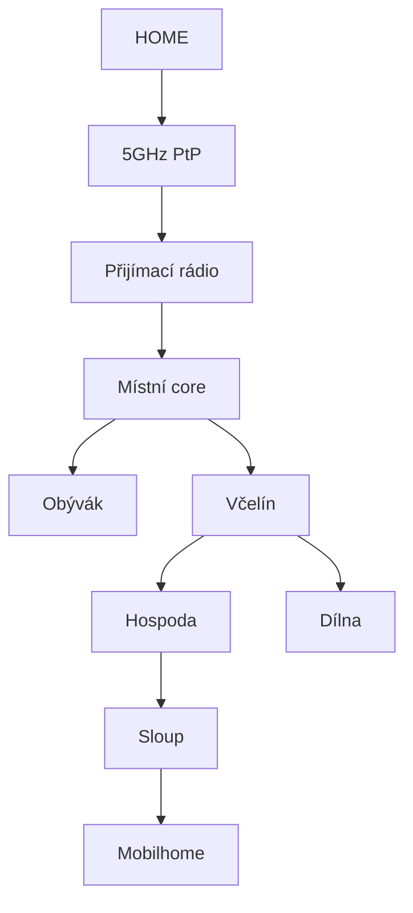
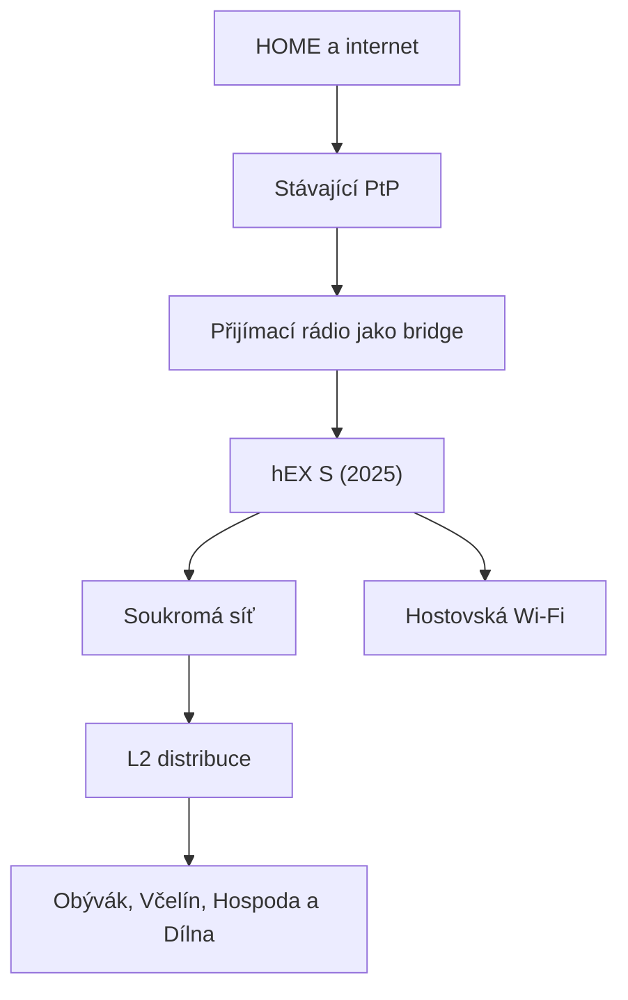

# Topologie

## Známá fyzická kostra

## Naposledy doložené části

| Část | Stav podle podkladů | Co zbývá ověřit |
|---|---|---|
| HOME ↔ Rybníky | doložený provoz | přesné modely, režimy a adresy obou PtP rádií |
| přijímací rádio | aktivní role | přesný model a zda dnes ještě routuje nebo NATuje |
| místní core | současný stav neověřený | které zařízení dnes poskytuje DHCP, firewall a NAT |
| Obývák | existující větev | aktivní zařízení a případný další NAT |
| Včelín | existující distribuční bod | switch, porty, napájení a další DHCP/NAT |
| Hospoda | existující větev | AP, klienti a pokračování směrem ke sloupu |
| Dílna | existující větev | AP a klienti |
| optika ke sloupu | rozpor v podkladech | zda je položená, zakončená a aktivní |
| sloup | další etapa | distribuce, Wi-Fi, napájení a ochrany |
| mobilhome | plán | trasa, viditelnost, napájení a požadovaná kapacita |

## Schválená cílová logika

hEX S (2025) bude jediným místním routerem, DHCP serverem a firewallem. Mezi HOME a privátní sítí Rybníků se použije přímé směrování přes PtP; pro toto propojení se nebude vytvářet WireGuard tunel. Hostovská Wi-Fi bude oddělená od privátní sítě, HOME a managementu.

Konkrétní LAN prefix Rybníků zatím není přidělený. Rozsah `192.168.22.0/24` patří lokalitě ŠÉF / RD Švecovi a jeho starší přiřazení Rybníkům bylo chybné.

## Co ověřit na místě

- [ ] Přesné modely, RouterOS a režimy obou PtP rádií.
- [ ] Které zařízení dnes routuje a poskytuje DHCP, NAT a firewall.
- [ ] Všechny další DHCP servery a NATy.
- [ ] Aktivní adresní rozsahy, statické IP a port-forwardy.
- [ ] Zařízení, porty a kabely v Obýváku, Včelíně, Hospodě a Dílně.
- [ ] Stav, typ a zakončení optiky ke sloupu.
- [ ] NVR, zařízení „Stavba“ a další klienty citlivé na změnu adresace.
- [ ] Napájení, PoE a přepěťovou ochranu venkovních částí.
