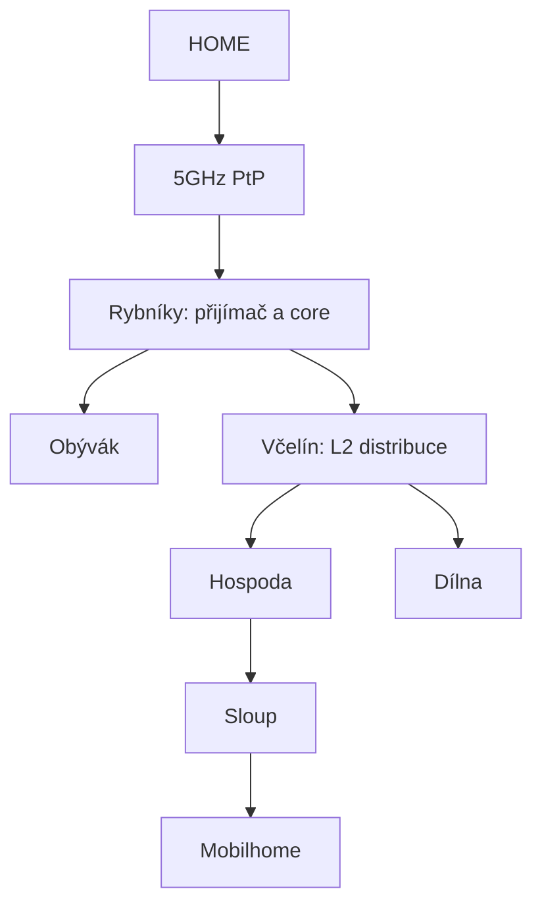

# Topologie

## Známá fyzická kostra

## Doložené a plánované části

| Část | Stav podle podkladů | Poznámka |
|---|---|---|
| HOME ↔ Rybníky | doložený provoz | 5GHz PtP, přibližně 500–600 m |
| přijímací rádio | aktivní role, přesný model neověřený | v podkladech se střídá Sextant a LHG |
| místní core | skutečný současný stav neověřený | historicky RB450G nebo hEX S; cílové rozhodnutí otevřené |
| Obývák | existující větev | aktivní zařízení a případný další NAT ověřit |
| Včelín | existující distribuční bod | ethernet do Hospody a Dílny; cílově pouze L2 |
| Hospoda | existující větev | PC/klienti, AP a pokračování směrem ke sloupu |
| Dílna | existující větev | místní AP a klienti |
| optika ke sloupu | rozpor v podkladech | ověřit, zda je položená, zakončená a aktivní |
| sloup | další etapa | venkovní distribuce, Wi-Fi a uplink k mobilhome |
| mobilhome | plán | ověřit trasu, viditelnost, napájení a požadovanou kapacitu |

## Historická adresace

V jednom starším mezistavu byla použita místní LAN `192.168.22.0/24` s DHCP a NATem na hEX S. Známé historické lease:

| Adresa | Označení |
|---|---|
| `192.168.22.10` | Stavba |
| `192.168.22.11` | NVR |
| `192.168.22.16` | neidentifikované zařízení |
| `192.168.22.17` | notebook |

Tento rozsah ani uvedené lease nejsou potvrzené jako současný živý stav. V jedné starší konfiguraci se navíc objevila chybná nebo duplicitní síť `192.168.1.0/24`.

## Co ověřit na místě

1. Přesné modely a role obou PtP rádií.
2. Které zařízení dnes routuje a poskytuje DHCP.
3. Všechny další DHCP servery a NATy.
4. Aktivní adresní rozsahy, statické IP a port-forwardy.
5. Zařízení a kabely v Obýváku, Včelíně, Hospodě a Dílně.
6. Stav, typ a zakončení optiky ke sloupu.
7. NVR, zařízení „Stavba“ a další klienty citlivé na změnu adresace.
8. Napájení, PoE a přepěťovou ochranu venkovních částí.
