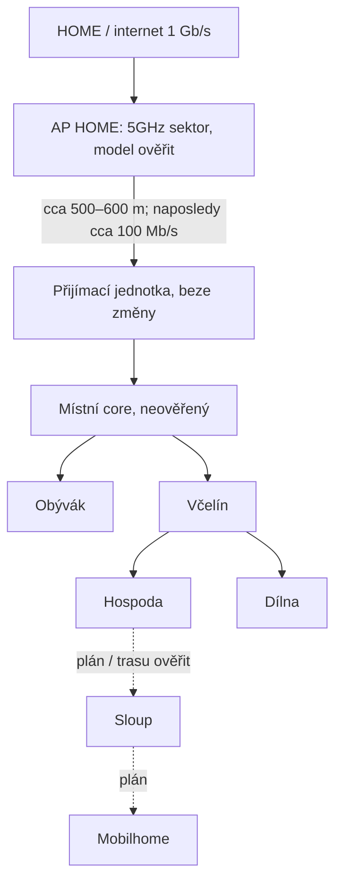
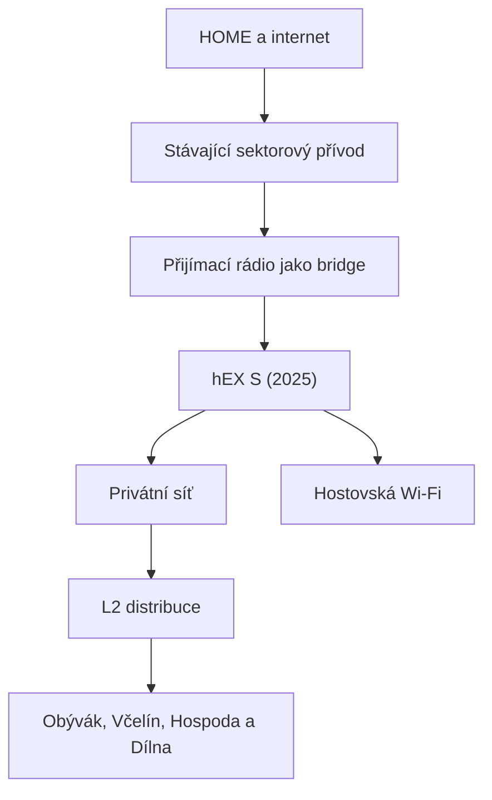

# Topologie

## Známá fyzická kostra

Přívod je sektorový/PtMP, nikoli vyhrazené PtP. Sloup a mobilhome jsou v diagramu záměrně vyznačené jako plánované části.

## Naposledy doložené části

| Část | Stav podle podkladů | Co zbývá ověřit |
|---|---|---|
| HOME | internetová přípojka 1 Gb/s | aktuální využití a omezení upstreamu |
| `AP HOME` | původní jednotka byla nahrazena kvalitnějším 5GHz sektorem; sektorový/PtMP provoz | přesný model, RouterOS, konfigurace, kanál a obsluhovaní klienti |
| rádiový přívod | vzdálenost přibližně 500–600 m; naposledy doloženo přibližně 100 Mb/s | aktuální RSSI, SNR, CCQ, negotiated rate, stabilita a reálná propustnost |
| přijímací jednotka | zůstala beze změny | přesný model, RouterOS a zda dnes ještě routuje nebo NATuje |
| místní core | současný stav neověřený | které zařízení dnes poskytuje DHCP, firewall a NAT |
| Obývák | existující větev | aktivní zařízení a případný další NAT |
| Včelín | existující distribuční bod | switch, porty, napájení a další DHCP/NAT |
| Hospoda | existující větev | AP, klienti a skutečný stav pokračování směrem ke sloupu |
| Dílna | existující větev | AP a klienti |
| optika ke sloupu | rozpor v podkladech | zda je položená, zakončená a aktivní |
| sloup | plánovaná etapa | distribuce, Wi-Fi, napájení a ochrany |
| mobilhome | plánovaná etapa | trasa, viditelnost, napájení a požadovaná kapacita |

## Schválená cílová logika

hEX S (2025) bude jediným místním routerem, DHCP serverem a firewallem. Mezi HOME a Rybníky se použije přímé směrování přes sektorový přívod; pro toto propojení se nebude vytvářet WireGuard tunel ani lokální NAT.

Konkrétní LAN prefix Rybníků zatím není přidělený. Rozsah `192.168.22.0/24` patří lokalitě ŠÉF / RD Švecovi a jeho starší přiřazení Rybníkům bylo chybné.

## Bezpečnostní směry

| Zdroj | Cíl | Výchozí politika |
|---|---|---|
| HOME – správa | management Rybníků | povolit |
| privátní síť Rybníků | HOME | zakázat; povolit jen jednotlivé schválené výjimky v allowlistu |
| hostovská síť | internet | povolit; počátečně 15 Mb/s na klienta a 70–80 Mb/s celkem |
| hostovská síť | privátní síť Rybníků, HOME a management | zakázat |
| host | jiný host | zakázat izolací klientů |

Limity hostovské sítě jsou počáteční nastavitelné hodnoty. Po nasazení se mohou změnit podle skutečné kapacity a provozu.

## Co ověřit na místě

- [ ] Ověřit přesný model, RouterOS a konfiguraci sektoru `AP HOME`.
- [ ] Ověřit přesný model, RouterOS a režim přijímací jednotky.
- [ ] Změřit aktuální rádiové parametry, stabilitu a reálnou propustnost přívodu.
- [ ] Určit zařízení, které dnes routuje a poskytuje DHCP, NAT a firewall.
- [ ] Zmapovat všechny další DHCP servery, NATy, aktivní rozsahy, statické IP a port-forwardy.
- [ ] Zmapovat zařízení, porty a kabely v Obýváku, Včelíně, Hospodě a Dílně.
- [ ] Ověřit stav, typ a zakončení optiky ke sloupu.
- [ ] Ověřit NVR, zařízení „Stavba“ a další klienty citlivé na změnu adresace.
