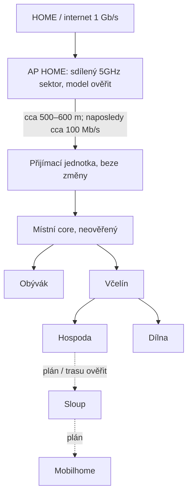
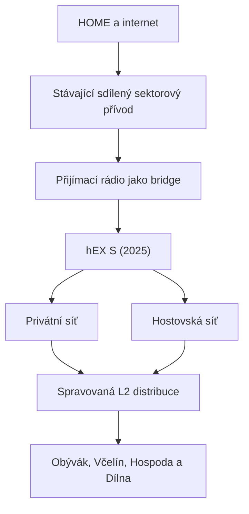

# Topologie

> Poslední doložený stav a schválená rozhodnutí: **2026-07-29**. Nejde o potvrzení současného živého stavu.

## Známá fyzická kostra

Přívod je sektorový/PtMP, nikoli vyhrazené PtP. Sektor na HOME obsluhuje také nejméně jedno další připojení. Sloup a mobilhome jsou v diagramu záměrně vyznačené jako plánované části.

## Naposledy doložené části

| Část | Stav podle podkladů | Co zbývá ověřit |
|---|---|---|
| HOME | internetová přípojka 1 Gb/s | aktuální využití a omezení upstreamu |
| `AP HOME` | původní jednotka byla nahrazena kvalitnějším 5GHz sektorem; sektorový/PtMP provoz; další připojení na stejném sektoru | přesný model, RouterOS, konfigurace, kanál a všichni obsluhovaní klienti |
| rádiový přívod | vzdálenost přibližně 500–600 m; naposledy doložena stabilní kapacita přibližně 100 Mb/s | aktuální RSSI, SNR, CCQ, negotiated rate, stabilita a reálná propustnost |
| přijímací jednotka | zůstala beze změny | přesný model, RouterOS a zda dnes ještě routuje nebo NATuje |
| místní core | současný stav neověřený | které zařízení dnes poskytuje DHCP, firewall a NAT |
| Obývák | existující větev | aktivní zařízení a případný další NAT |
| Včelín | existující distribuční bod | switch, porty, napájení a další DHCP/NAT |
| Hospoda | existující větev | AP, klienti a skutečný stav pokračování směrem ke sloupu |
| Dílna | existující větev | AP a klienti |
| optika ke sloupu | rozpor v podkladech | zda je položená, zakončená a aktivní |
| sloup | plánovaná etapa | distribuce, Wi-Fi, napájení a ochrany |
| mobilhome | plánovaná etapa | trasa, viditelnost, napájení a požadovaná kapacita |

Všechny údaje ve třetím sloupci tabulky: **Vyžaduje ověření v živém systému.**

## Schválená cílová logika

hEX S (2025) bude jediným místním routerem, DHCP serverem a firewallem. Mezi HOME a Rybníky se použije přímé směrování přes sektorový přívod; pro toto propojení se nebude vytvářet WireGuard tunel ani lokální NAT.

Konkrétní LAN prefix Rybníků zatím není přidělený. Rozsah `192.168.22.0/24` patří lokalitě ŠÉF / RD Švecovi a jeho starší přiřazení Rybníkům bylo chybné.

## Wi-Fi model

- na všech vhodných AP budou dostupná stejná privátní a hostovská SSID;
- privátní síť je určená majiteli, rodině a kolegovi a podle schválených pravidel zpřístupní místní interní zařízení;
- hostovská síť poskytne pouze internet, bez přístupu do privátní sítě, HOME a managementu a bez komunikace hostů mezi sebou;
- údaje hostovské sítě musí být měnitelné centrálně; QR kód je přípustný způsob předání;
- AP se připojují kabelem a rozmístí podle měření pokrytí; hlavní důraz je na použitelné 2,4GHz pokrytí, nikoli na nejvyšší laboratorní rychlost;
- kanály a vysílací výkon se koordinují podle skutečného prostředí;
- bezdrátové repeatery ani mesh nenahrazují dostupnou kabelovou trasu; kde kabel skutečně nelze použít, nasadí se samostatný MikroTik PtP spoj.

Způsob centrální správy AP a konkrétní VLAN: **Vyžaduje ověření v živém systému.** Rozhodnutí se provede až po inventuře.

## Bezpečnostní směry

| Zdroj | Cíl | Výchozí politika |
|---|---|---|
| HOME – správa | management Rybníků | povolit |
| privátní síť Rybníků | HOME | zakázat; povolit jen jednotlivé schválené výjimky v allowlistu |
| hostovská síť | internet | povolit; počátečně 15 Mb/s na klienta a 70–80 Mb/s celkem |
| hostovská síť | privátní síť Rybníků, HOME a management | zakázat |
| host | jiný host | zakázat izolací klientů |

Limity hostovské sítě jsou počáteční nastavitelné hodnoty. Po nasazení se mohou změnit podle skutečné kapacity a provozu.

## Přístup a zdroje pravdy

- Přesná živá management cesta a management adresy zařízení: **Vyžaduje ověření v živém systému.**
- Správa se provádí z důvěryhodné sítě HOME nebo místně; veřejný WinBox, WebFig ani SSH se nezapíná jako nouzový workaround.
- Obecná čtecí inventura, bezpečný postup změny a aktualizace RouterOS jsou v [MadMike / Síť / MikroTik](../MadMike/Sit/MikroTik.md).
- Konkrétní prefix se přidělí podle [společného adresního plánu](../MadMike/Sit/Adresni-plan.md).
- Živá konfigurace zařízení rozhoduje o skutečném provozním stavu; rozdíl proti dokumentaci se nejdřív zaznamená, ne automaticky opraví.

## Běžná provozní kontrola

Po dokončení cílové rekonstrukce nebo při pravidelné kontrole:

1. ověřit dostupnost sektoru `AP HOME`, přijímací jednotky a hEX S;
2. na hEX S zkontrolovat uptime, CPU, RAM, storage, čas a systémový log;
3. ověřit stav rádiového přívodu, chybovost, RSSI, SNR, CCQ a skutečnou propustnost proti poslednímu známému normálu;
4. ověřit lokální DHCP, DNS, default route a internet na skutečném klientovi;
5. otestovat správu z HOME a současně potvrdit zákaz nevyžádaného provozu z Rybníků do HOME;
6. ověřit dostupnost Včelína, Hospody, Dílny a Obýváku a stav jejich uplinků;
7. na privátním klientovi ověřit internet a očekávané místní služby;
8. na hostovském klientovi ověřit internet, limity, zákaz interních sítí a izolaci od druhého hosta;
9. ověřit NVR a zařízení „Stavba“, dokud jejich role nebude při inventuře jednoznačně uzavřená;
10. porovnat stav s Mikr Managerem a zkontrolovat, zda jedna porucha upstreamu nevytváří lavinu alarmů.

Před dokončením rekonstrukce se tento postup použije jen v rozsahu funkcí, které jsou skutečně aktivní. Plánovaný stav se nesmí vydávat za živý.

## Diagnostika podle projevu

| Projev | První kontrola | Další bezpečný krok |
|---|---|---|
| Nedostupná celá lokalita | napájení, sektor `AP HOME`, přijímací rádio, hEX S nebo současný core | určit poslední dostupný bod od HOME; neměnit současně rádio a routing |
| Rybníky jsou dostupné z HOME, ale klienti nemají internet | default route, DNS, firewall a DHCP na místním core | testovat IP i DNS ze skutečného klienta a porovnat poslední změnu |
| Jedna větev nefunguje | port, kabel, napájení a L2 bod před větví | postupovat od společného uplinku ke klientovi; nepřestavovat ostatní větve |
| Vše za Včelínem nefunguje | uplink a napájení Včelína, smyčka nebo porucha distribučního prvku | ponechat Obývák beze změny a izolovat pouze větev Včelína |
| Jedno AP nefunguje | PoE, kabel, ethernet link, konfigurace AP | ověřit drátového klienta ve stejné větvi a stav AP v Mikru |
| Všechna AP nefungují | core, společná konfigurace SSID, VLAN/CAPsMAN, DHCP | nejprve ověřit drátovou LAN a jediný zdroj Wi-Fi konfigurace |
| Privátní síť funguje, hosté ne | guest SSID, přiřazení segmentu, DHCP, firewall, limity | neopravovat problém dočasným povolením přístupu do privátní sítě |
| Host vidí interní zařízení nebo jiného hosta | firewall, bridge/VLAN a client isolation | hostovskou síť odstavit nebo vrátit poslední známou bezpečnou konfiguraci |
| Nízká nebo kolísající rychlost celé lokality | sektor sdílený s dalšími klienty, rádiové parametry, rušení a upstream | měřit v klidové i zatížené době; konfiguraci sdíleného sektoru měnit až po dopadové analýze |
| Mikr hlásí mnoho zařízení současně | společný upstream nebo napájení lokality | řešit jednu kořenovou událost a potlačit duplicitní navazující alarmy |
| Problém vznikl po změně | poslední změněná etapa a její přejímací test | zastavit další zásahy a použít připravený rollback z [plánu rekonstrukce](Plan-rekonstrukce.md) |

## Přejímka po běžné změně

Po změně jednoho zařízení, portu, AP nebo konfigurace se podle dopadu ověří:

- management z HOME a místní nouzový přístup;
- uplink a skutečná datová cesta, ne pouze stav `running`;
- DHCP, DNS, internet a očekávané místní služby;
- NVR, „Stavba“ a statické klienty v dotčené větvi;
- privátní i hostovské SSID a jejich bezpečnostní směry;
- stav Mikru a vznik pouze očekávaných alarmů;
- nový označený backup a `.rsc` export až po úspěšné přejímce.

## Handover minimum

Před samostatnou správou musí být známé nebo živě ověřené:

- oba konce rádiového přívodu, sdílení sektoru a dopad jeho výpadku;
- skutečný core, jeho místní přístup, DHCP, DNS, routing, firewall a případný současný NAT;
- aktivní prefixy, statické adresy, port-forwardy a potřebné směry mezi Rybníky a HOME;
- fyzické porty, kabely, napájení a uplinky všech větví;
- aktivní AP, způsob jejich správy, SSID a bezpečnostní oddělení;
- role NVR, zařízení „Stavba“ a dalších kritických klientů;
- poslední použitelné zálohy, rollback kabeláže a osoba schopná místního zásahu;
- očekávané monitory a alarmy v Mikru.

Dokud některý z těchto bodů není známý, provádějí se pouze neinvazivní kontroly nebo změny s prokazatelně omezeným dopadem.

## Co ověřit na místě

> Následující body **vyžadují ověření v živém systému**.

- [ ] Ověřit přesný model, RouterOS, konfiguraci a ostatní klienty sektoru `AP HOME`.
- [ ] Ověřit přesný model, RouterOS a režim přijímací jednotky.
- [ ] Změřit aktuální rádiové parametry, stabilitu a reálnou propustnost přívodu.
- [ ] Určit zařízení, které dnes routuje a poskytuje DHCP, NAT a firewall.
- [ ] Zmapovat všechny další DHCP servery, NATy, aktivní rozsahy, statické IP a port-forwardy.
- [ ] Zmapovat zařízení, porty a kabely v Obýváku, Včelíně, Hospodě a Dílně.
- [ ] Ověřit stav, typ a zakončení optiky ke sloupu.
- [ ] Ověřit NVR, zařízení „Stavba“ a další klienty citlivé na změnu adresace.
- [ ] Ověřit současnou management cestu, možnost místního zásahu a skutečné zařazení lokality v Mikru.
